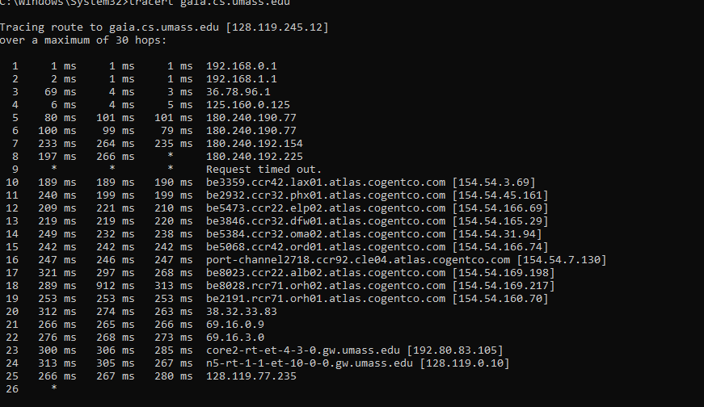
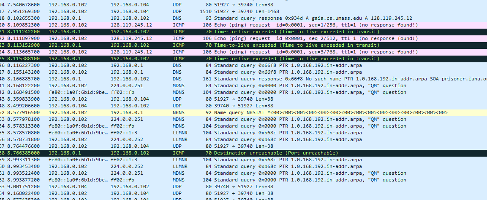
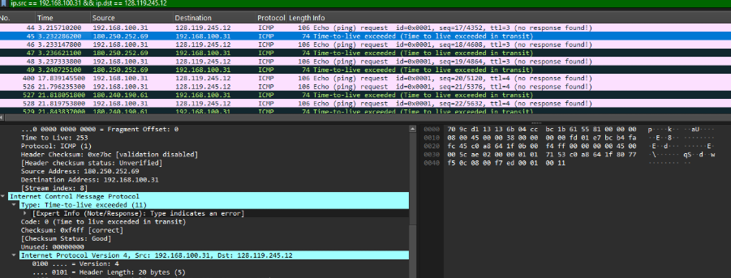
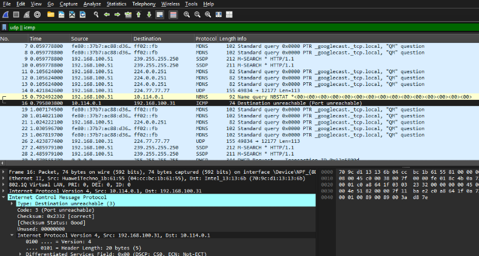

### Laporan Praktikum Modul 10

**Praktikan:** **Haniel Juanta Sembiring**  
**NIM:** **103072400145**  
**Kelas:** **IF-04-01**

---

### Tujuan
- Menganalisis protokol IP menggunakan Wireshark.  
- Memahami header IPv4, mekanisme TTL/traceroute, dan fragmentasi.

---

### Peralatan dan File
- **Perangkat lunak:** Wireshark, Command Prompt (Windows) / Terminal (Linux, macOS)  
- **Perintah utama (Windows):**
```bash
tracert gaia.cs.umass.edu
```
- **Folder laporan:** `modul10/` dengan subfolder `Gambar/` berisi screenshot `1.png`–`4.png`.

---

### Langkah Praktikum (singkat, urut)
1. **Mulai capture** di Wireshark pada interface aktif (mis. Wi‑Fi).  
2. **Jalankan traceroute** di terminal:  
   ```bash
   tracert gaia.cs.umass.edu
   ```  
3. **Hentikan capture** setelah traceroute selesai.  
4. **Filter di Wireshark** untuk analisis:  
   - Semua ICMP: `icmp`  
   - ICMP ke host lokal: `icmp && ip.dst == <IP-Anda>`  
   - Request spesifik: `ip.src == <IP-Anda> && ip.dst == 128.119.245.12`  
5. **Ambil screenshot**: overview traceroute, detail ICMP Echo Request, detail ICMP TTL Exceeded, contoh Destination Unreachable (jika ada).  
6. **Simpan** capture dan screenshot ke folder `Gambar/`.

---

### Hasil (sertakan screenshot)
- **Overview traceroute (daftar hop).**  
  `

- **Detail ICMP Echo Request (contoh: TTL, Total Length, Identification).**  
  `

- **Detail ICMP Time-to-live exceeded (Type 11) dari router intermediate.**  
  `

- **Contoh ICMP Destination Unreachable (Type 3, Code 3) atau hasil DNS/MDNS terkait.**  
  `

---

### Analisis Singkat
- **Traceroute:** mengirim paket dengan TTL meningkat; setiap router yang TTL‑nya habis mengirim ICMP Type 11 sehingga terlihat hop per hop.  
- **ICMP yang diamati:** Type 8 (Echo Request), Type 11 (TTL Exceeded), Type 3 Code 3 (Destination Unreachable) — sesuai hasil capture.  
- **Header IPv4 penting yang diperiksa:** Version, Header Length, Total Length, Identification, Flags (DF/MF), Fragment Offset, TTL, Protocol, Source, Destination.  
- **Fragmentasi:** tidak teramati pada capture ini karena `Total Length` paket jauh lebih kecil dari MTU (1500 bytes); Flags MF=0 dan Fragment Offset=0 mengonfirmasi tidak ada fragmentasi.  
- **Catatan routing:** beberapa hop menunjukkan timeout (`*`) — normal jika router tidak merespon traceroute; beberapa hop melewati jaringan backbone (contoh: cogentco).

---

### Kesimpulan (singkat)
- Traceroute dan Wireshark berhasil digunakan untuk mengidentifikasi jalur (hop) ke `gaia.cs.umass.edu` dan menganalisis pesan ICMP.  
- Header IPv4 dan field TTL/Identification/Flags dapat diamati dan dianalisis; tidak ditemukan fragmentasi pada capture ini.  

---

### Daftar Pustaka (singkat)
- Kurose, J.F., & Ross, K.W. — *Computer Networking: A Top-Down Approach*.  
- Wireshark Foundation — *Wireshark User's Guide*.  
- RFC 792 (ICMP), RFC 1812 (IP routers).

