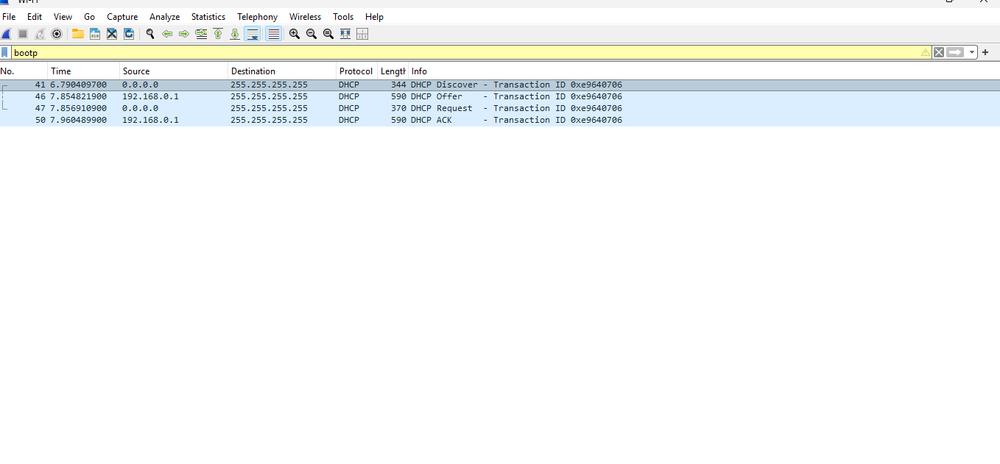
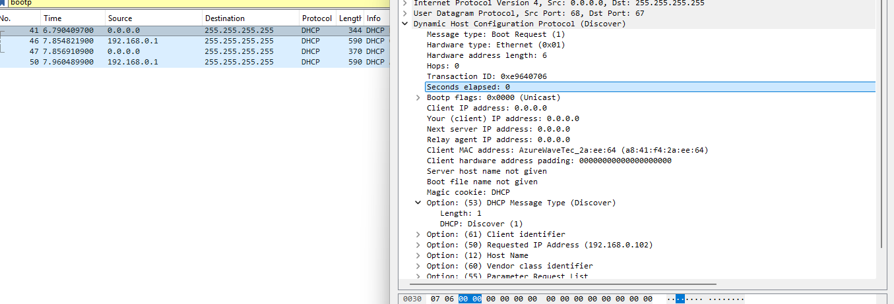
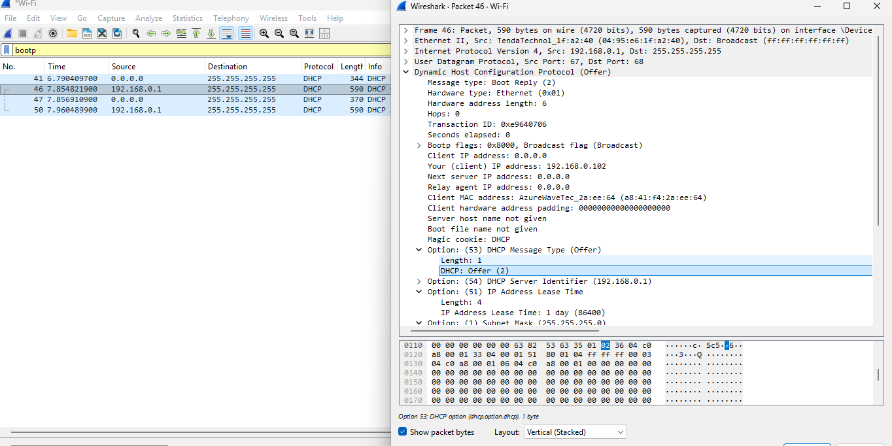
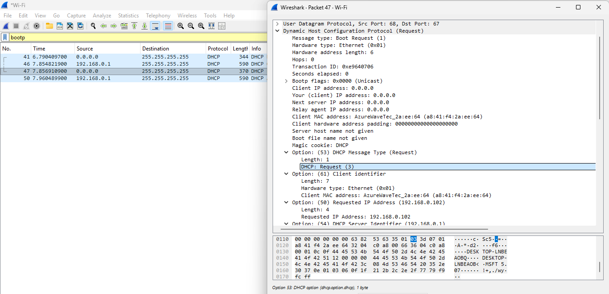
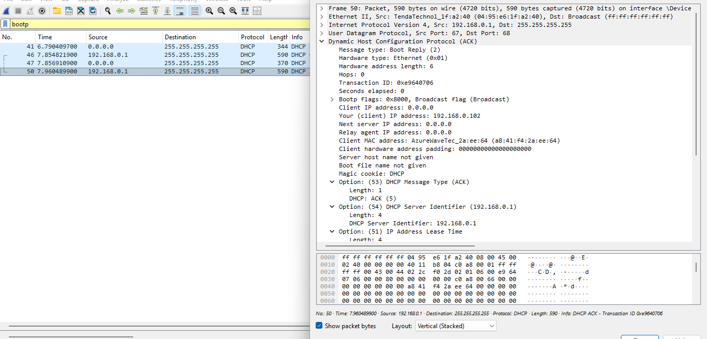

# Laporan Praktikum Jaringan Komputer - Modul 11
## Dynamic Host Configuration Protocol (DHCP)

### Identitas Praktikan
| Item | Keterangan |
| :--- | :--- |
| **Nama** | Hanieljuanta Sembiring |
| **NIM** | 103072400145 |
| **Kelas** | IF-04-01 |

---

### 11.1 Tujuan Praktikum
1. Menangkap dan menganalisis paket DHCP menggunakan Wireshark.
2. Memahami proses DORA (Discover-Offer-Request-ACK).
3. Melihat konfigurasi jaringan yang diberikan DHCP server.

---

### 11.2 Langkah Praktikum yang Dilakukan
1. Membuka Command Prompt (CMD).
2. Menjalankan perintah `ipconfig /release` untuk melepaskan IP address saat ini.
   > **Bukti:** Lihat Gambar 1
3. Memulai proses *capture* pada Wireshark dengan memilih interface Wi-Fi.
4. Menjalankan perintah `ipconfig /renew` pada Command Prompt untuk meminta alokasi IP baru dari DHCP Server.
   > **Bukti:** Lihat Gambar 2
5. Menghentikan *capture* Wireshark setelah IP baru muncul di CMD.
6. Memfilter paket jaringan menggunakan *display filter* `bootp`.

---

### 11.3 Hasil Praktikum

#### 11.3.1 Paket DHCP yang Berhasil Ditangkap
Filter yang digunakan: `bootp`

**Tabel Paket DHCP:**

| Frame | Waktu | Message Type | Source | Destination | Transaction ID |
| :--- | :--- | :--- | :--- | :--- | :--- |
| 41 | 6.790409700 | DHCP Discover | 0.0.0.0 | 255.255.255.255 | 0xe9640706 |
| 46 | 7.854821900 | DHCP Offer | 192.168.0.1 | 255.255.255.255 | 0xe9640706 |
| 47 | 7.856910900 | DHCP Request | 0.0.0.0 | 255.255.255.255 | 0xe9640706 |
| 50 | 7.960489900 | DHCP ACK | 192.168.0.1 | 255.255.255.255 | 0xe9640706 |

> **Catatan:** Empat paket di atas adalah proses DORA awal. Transaction ID `0xe9640706` konsisten pada keempat paket, menandakan mereka berada dalam satu sesi DHCP yang sama.

#### 11.3.2 DHCP Discover (Frame 41)

*   **Message type:** Boot Request (1) - Discover
*   **Transaction ID:** 0xe9640706
*   **Client MAC address:** [Masukkan MAC Address Anda dari Wireshark, misal: xx:xx:xx:xx:xx:xx]
*   **Client IP address:** 0.0.0.0 (Klien belum memiliki IP)

**Yang terjadi:**
Klien melakukan *broadcast* (`255.255.255.255`) untuk mencari DHCP server yang tersedia di jaringan karena klien belum memiliki IP address. Klien meminta konfigurasi standar seperti subnet mask, router, dan DNS.

#### 11.3.3 DHCP Offer (Frame 46)

*   **Message type:** Boot Reply (2) - Offer
*   **Transaction ID:** 0xe9640706 (Sama dengan Discover)
*   **Your (client) IP address:** [IP yang ditawarkan, cek detail paket, misal: 192.168.0.x]
*   **Server IP:** 192.168.0.1

**Yang ditawarkan server:**
Server menawarkan sebuah IP Address beserta konfigurasi jaringan lainnya (Subnet Mask, Router/Gateway, DNS Server, dan Lease Time).

#### 11.3.4 DHCP Request (Frame 47)

*   **Message type:** Boot Request (3) - Request
*   **Requested IP Address:** [IP yang ditawarkan sebelumnya]
*   **Transaction ID:** 0xe9640706

**Yang terjadi:**
Klien menerima tawaran dari server dan melakukan *request* IP tersebut secara formal, serta memilih server spesifik (192.168.0.1) jika terdapat lebih dari satu penawaran.

#### 11.3.5 DHCP ACK (Frame 50)

*   **Message type:** Boot Reply (5) - ACK
*   **Transaction ID:** 0xe9640706
*   **Your (client) IP address:** [IP Final yang didapat]

**Konfirmasi server:**
Server memberikan persetujuan (ACK) berupa penetapan IP final, waktu sewa (*Lease time*), beserta Gateway & DNS.

---

### 11.4 Analisis Praktikum

#### 11.4.1 Proses DORA yang Teramati
Proses DORA berjalan dengan sangat cepat berdasarkan data yang tertangkap:
*   **Discover:** Terjadi pada detik ke-6.79
*   **Offer:** Terjadi pada detik ke-7.85 (selisih ~1.06 detik)
*   **Request:** Terjadi pada detik ke-7.86 (hanya 0.01 detik setelah Offer)
*   **ACK:** Terjadi pada detik ke-7.96 (selisih ~0.1 detik dari Request)

Total waktu dari Discover hingga ACK kurang dari **1.2 detik**. Hal ini menunjukkan jaringan lokal yang responsif dan DHCP server yang cepat dalam memproses permintaan.

#### 11.4.2 Transaction ID Analysis
Berdasarkan hasil observasi, **Transaction ID** tetap konsisten (`0xe9640706`) selama satu rangkaian proses DORA penuh.
*   Discover: `0xe9640706`
*   Offer: `0xe9640706`
*   Request: `0xe9640706`
*   ACK: `0xe9640706`

Hal ini membuktikan bahwa Transaction ID digunakan sebagai identitas pengenal agar paket-paket *Request* dan *Reply* tidak tertukar dengan sesi DHCP lain atau klien lain di dalam jaringan yang sama.

#### 11.4.3 Broadcast vs Unicast
Pada fase *Initial DORA* yang tercatat di sini, proses komunikasi dilakukan secara **Broadcast** (`255.255.255.255`) pada semua tahap (Discover, Offer, Request, ACK).
*   **Discover & Request:** Client mengirim dari `0.0.0.0` ke `255.255.255.255` karena belum punya IP.
*   **Offer & ACK:** Server mengirim ke `255.255.255.255` (Broadcast) karena pada tahap ini client mungkin belum sepenuhnya mengikat IP tersebut ke stack network-nya sebelum ACK final, atau konfigurasi server diatur untuk broadcast reply.

---

### 11.5 Kesimpulan
1. Praktikum berhasil melakukan penangkapan paket DHCP (Discover, Offer, Request, ACK) secara utuh menggunakan *display filter* `bootp` di aplikasi Wireshark.
2. Proses DORA terbukti berjalan secara berurutan dengan **Transaction ID** `0xe9640706` yang konsisten.
3. Klien berhasil mendapatkan parameter konfigurasi jaringan secara otomatis dari server `192.168.0.1`.
4. Analisis menunjukkan bahwa komunikasi awal menggunakan metode *broadcast* karena klien belum memiliki alamat IP yang valid.

---

### Daftar Pustaka
*   Modul Praktikum Jaringan Komputer, Universitas Telkom (2026).
*   RFC 2131: Dynamic Host Configuration Protocol.
*   Wireshark Documentation: https://www.wireshark.org/docs/