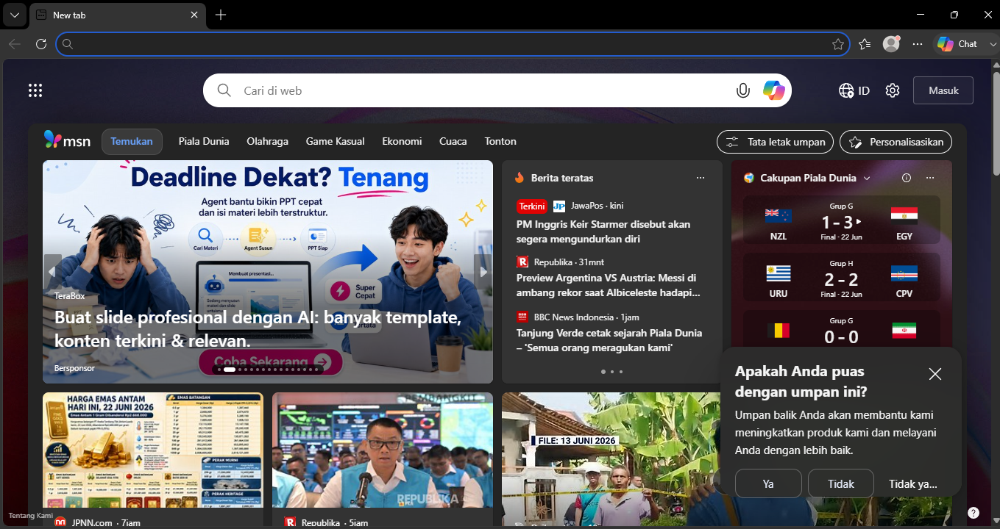
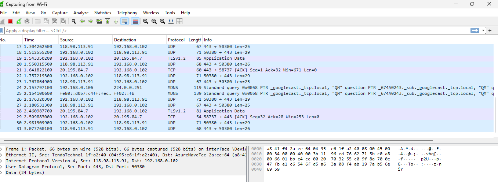
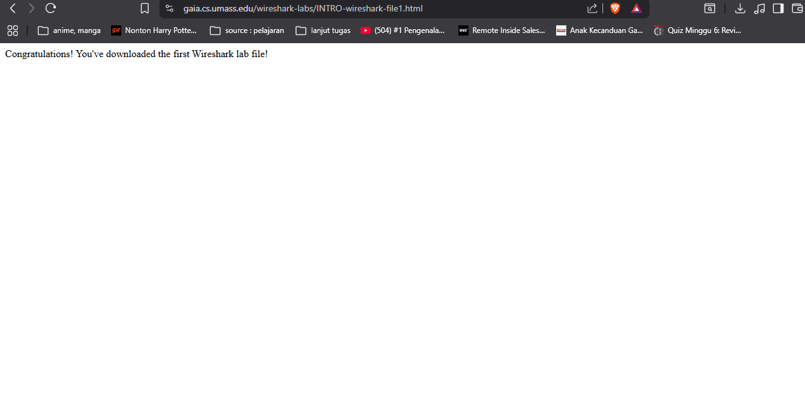
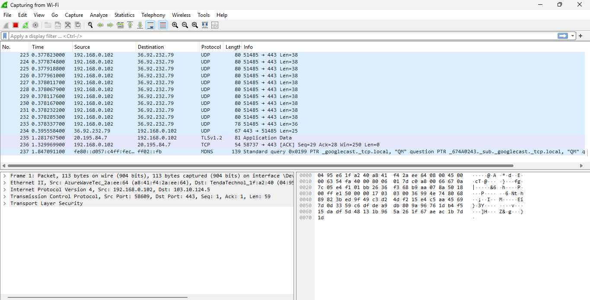
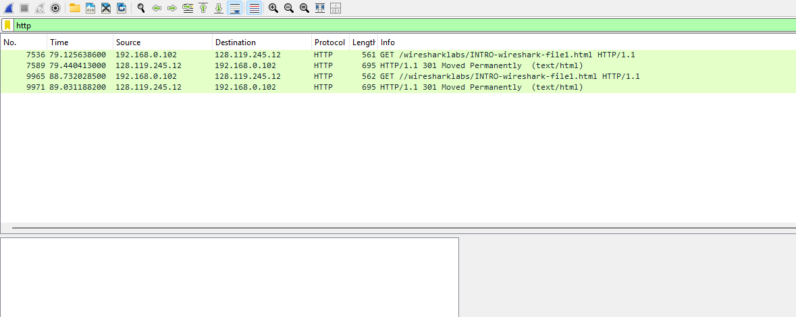
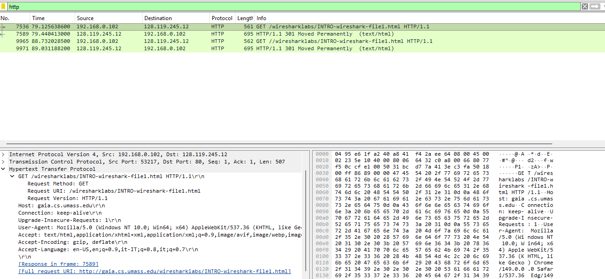

# Laporan Praktikum Jaringan Komputer - Modul 2
## Pengenalan Tools dan Test Run Wireshark

### Identitas Praktikan
| Item | Keterangan |
| :--- | :--- |
| **Nama** | Haniel Juanta Sembiring |
| **NIM** | 103072400145 |
| **Kelas** | IF-04-01 |

---

## 1. Tujuan Praktikum
1. Mahasiswa dapat melakukan instalasi tool yang digunakan (Wireshark).
2. Mahasiswa dapat menggunakan tool (Wireshark) untuk menangkap dan mengidentifikasi paket data.

---

## 2. Konsep Dasar: Cara Kerja Packet Sniffer
Sebelum memulai, penting untuk memahami bahwa Wireshark bertindak sebagai *Packet Sniffer* pasif. Aplikasi ini tidak mengirim paketnya sendiri, melainkan hanya "mendengarkan" dan menyalin paket data yang keluar-masuk melalui kartu jaringan komputer Anda.

Ada dua komponen utama:
* **Packet Capture Library:** Menerima salinan fisik dari setiap *frame* yang lewat di antarmuka jaringan (seperti Wi-Fi atau kabel Ethernet).
* **Packet Analyzer:** Menerjemahkan dan menampilkan isi pesan tersebut agar bisa dibaca (misalnya memisahkan format Ethernet, IP, TCP, hingga pesan HTTP).

---

## 3. Langkah Kerja dan Hasil

**1. Siapkan Aplikasi:** Buka *web browser* (Chrome, Edge, dll) dan jalankan aplikasi Wireshark.

**2. Mulai Menangkap Jaringan (Capture):** Di Wireshark, klik menu **Capture > Interfaces**. Pilih koneksi yang sedang kamu gunakan untuk internet lalu klik **Start**. Wireshark akan mulai merekam lalu lintas jaringan.

**3. Buka Tautan Target:** Beralih ke *browser*, lalu salin dan buka tautan ini: 
`http://gaia.cs.umass.edu/wiresharklabs/INTRO-wireshark-file1.html`

**4. Hentikan Penangkapan (Stop Capture):** Setelah halaman web dari tautan tersebut terbuka, segera kembali ke aplikasi Wireshark dan hentikan proses perekaman jaringan dengan mengklik tombol **Stop**.

**5. Filter dengan HTTP:** Ketikkan `http` pada kolom filter di bagian atas Wireshark lalu tekan Enter. Hal ini dilakukan agar layar hanya menampilkan paket data dari protokol HTTP.

**6. Analisis Paket Data:** Setelah difilter, akan muncul daftar aktivitas HTTP. Di sini kita dapat melihat paket permintaan (*HTTP GET request*) yang kita kirimkan ke server, dan paket balasan yang dikirim kembali oleh server (*response*). Kita dapat mengklik paket tersebut untuk melihat detail dari respons web dan isi pesan GET di dalamnya.
