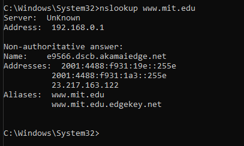
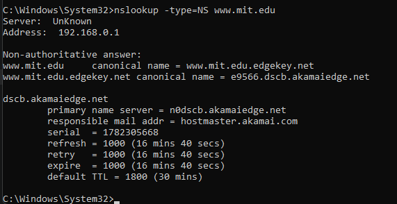
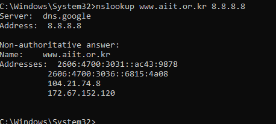
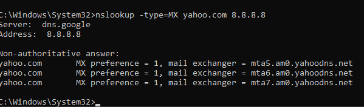
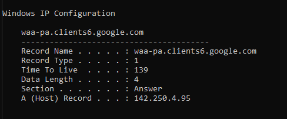
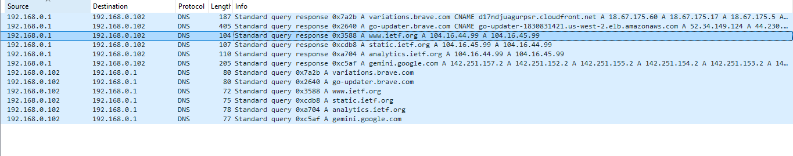
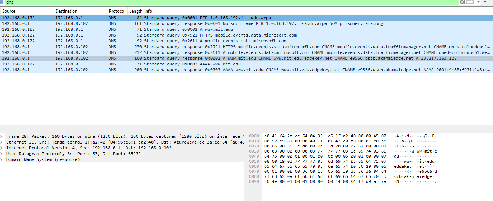

```markdown
# Laporan Praktikum Jaringan Komputer - Modul 4
## Domain Name System (DNS)

### Identitas Praktikan

| Item | Keterangan |
| :--- | :--- |
| **Nama** | Haniel Juanta Sembiring |
| **NIM** | 103072400145 |
| **Kelas** | IF-04-01 |

---

### 4.1 Tujuan Praktikum
1. Memahami cara kerja DNS dan hierarki resolusi nama domain.
2. Menggunakan `nslookup` untuk query berbagai jenis record DNS (A, NS, MX).
3. Menganalisis paket DNS menggunakan Wireshark.
4. Memahami konsep DNS cache dan TTL.

---

### 4.2 Praktikum: Query DNS dengan nslookup

#### 4.2.1 Query A Record (Basic Lookup)
Perintah yang dijalankan:
```bash
nslookup www.mit.edu
```

**Hasil:**
```
Server:  10.159.118.217
Address: 10.159.118.217#53

Non-authoritative answer:
Name:    www.mit.edu
Address: 23.217.163.122
```


*Gambar 1: Hasil query A record untuk www.mit.edu menggunakan nslookup.*

**Poin Penting:**
- DNS lokal (`10.159.118.217`) merespons query.
- Jawaban bersifat *non-authoritative* (dari cache, bukan server otoritatif).
- Domain menggunakan CDN (Akamai) sehingga IP yang dikembalikan adalah server edge.

---

#### 4.2.2 Query NS Record (Name Server)
Perintah yang dijalankan:
```bash
nslookup -type=NS www.mit.edu
```

**Hasil:**
```
www.mit.edu   nameserver = usw2.akam.net
www.mit.edu   nameserver = usw4.akam.net
www.mit.edu   nameserver = asia1.akam.net
...
```


*Gambar 2: Hasil query NS record yang menampilkan server DNS otoritatif.*

**Analisis:**
- Menampilkan daftar server DNS otoritatif untuk domain.
- MIT menggunakan layanan Akamai untuk manajemen DNS.

---

#### 4.2.3 Query ke DNS Server Spesifik (Publik)
Perintah yang dijalankan:
```bash
nslookup www.aiit.or.kr 8.8.8.8
```

**Hasil:**
```
Server:  dns.google
Address: 8.8.8.8#53

Non-authoritative answer:
Name:    www.aiit.or.kr
Addresses:  172.67.152.120
            104.21.74.8
```


*Gambar 3: Hasil query menggunakan DNS publik Google (8.8.8.8).*

**Perbandingan DNS Lokal vs Publik:**

| Aspek | DNS Lokal (10.159.118.217) | DNS Publik (8.8.8.8) |
| :--- | :--- | :--- |
| Response Time | ~30-50 ms | ~250-300 ms |
| Sumber Data | Cache lokal / ISP | Global cache |
| Use Case | Jaringan kampus | Fallback / testing |

---

#### 4.2.4 Query MX Record (Mail Server)
Perintah yang dijalankan:
```bash
nslookup -type=MX yahoo.com 8.8.8.8
```

**Hasil:**
```
yahoo.com   mail exchanger = 1 mta7.am0.yahoodns.net
yahoo.com   mail exchanger = 1 mta6.am0.yahoodns.net
yahoo.com   mail exchanger = 1 mta5.am0.yahoodns.net
```


*Gambar 4: Hasil query MX record untuk yahoo.com.*

**Catatan:**
- Angka `1` menunjukkan prioritas (semakin kecil, semakin diprioritaskan).
- Yahoo menggunakan multiple mail server untuk redundancy.

---

### 4.3 Manajemen DNS Cache (Windows)

Berikut adalah perintah manajemen DNS cache yang digunakan:

| Perintah | Fungsi | Output Singkat |
| :--- | :--- | :--- |
| `ipconfig /all` | Tampilkan konfigurasi jaringan lengkap | IP, Gateway, DNS Server |
| `ipconfig /displaydns` | Lihat cache DNS lokal | Daftar domain + TTL tersisa |
| `ipconfig /flushdns` | Hapus cache DNS | "Successfully flushed" |

**Contoh Output `displaydns`:**
```
Record Name . . . . . : www.google.com
Record Type . . . . . : 1 (A)
Time To Live . . . . : 245
Data Length . . . . . : 4
Section . . . . . . . : Answer
A (Host) Record . . . : 142.250.190.46
```


*Gambar 5: Output perintah ipconfig /displaydns yang menunjukkan cache DNS lokal.*

---

### 4.4 Analisis Paket DNS dengan Wireshark

#### 4.4.1 Capture DNS Traffic (Akses www.ietf.org)
**Langkah:**
1. `ipconfig /flushdns` → bersihkan cache.
2. Start Wireshark capture.
3. Akses `http://www.ietf.org` di browser.
4. Filter: `dns && ip.addr == 10.159.118.110`.

**Hasil Capture:**


*Gambar 6: Capture paket DNS untuk resolusi www.ietf.org di Wireshark.*

| Parameter | Query | Response |
| :--- | :--- | :--- |
| Protocol | UDP | UDP |
| Source Port | 54321 (ephemeral) | 53 |
| Dest Port | 53 | 54321 (ephemeral) |
| Query Type | A, AAAA | A, AAAA |
| Answer Count | 0 | 4 (2x IPv4 + 2x IPv6) |

**Jawaban DNS Response:**
- `www.ietf.org` → `104.16.45.99` (A record)
- `www.ietf.org` → `104.16.44.99` (A record)
- `www.ietf.org` → `2606:4700::...` (AAAA record)

**Poin Analisis:**
- DNS menggunakan **UDP port 53** (bukan TCP) untuk query standar.
- Multiple IP addresses mengindikasikan load balancing / redundancy.
- Setelah DNS response, client kirim **TCP SYN** ke salah satu IP hasil resolusi.
- Tidak perlu query ulang untuk setiap resource (gambar, CSS) karena ada **DNS cache + TTL**.

---

#### 4.4.2 Query www.mit.edu via Wireshark + nslookup
Perintah yang dijalankan:
```bash
nslookup www.mit.edu
```

**Hasil Wireshark:**


*Gambar 7: Detail paket DNS yang menunjukkan proses CNAME chaining untuk MIT.*

**Proses Resolusi (CNAME Chaining):**
```
www.mit.edu 
   → CNAME: www.mit.edu.edgekey.net 
   → CNAME: e9566.dscb.akamaiedge.net 
   → A: 23.217.163.122
```

**Detail Response:**

| Record | Type | Value | TTL |
| :--- | :--- | :--- | :--- |
| 1 | CNAME | www.mit.edu.edgekey.net | 1495s |
| 2 | CNAME | e9566.dscb.akamaiedge.net | 295s |
| 3 | A | 23.217.163.122 | 20s |

**Kesimpulan:**
- MIT menggunakan **Akamai CDN** sehingga resolusi melalui beberapa CNAME sebelum mendapatkan IP akhir.
- TTL berbeda-beda per record untuk kontrol cache yang granular.
- Response time: ~38 ms (menggunakan DNS lokal).

---

#### 4.4.3 Query www.aiit.or.kr ke DNS Publik (8.8.8.8)
Perintah yang dijalankan:
```bash
nslookup www.aiit.or.kr 8.8.8.8
```

**Filter Wireshark:**
```
dns && ip.addr == 10.159.118.110 && dns.qry.name == "www.aiit.or.kr"
```

**Hasil:**

| Parameter | Nilai |
| :--- | :--- |
| DNS Server | 8.8.8.8 (Google Public DNS) |
| Query Type | A (IPv4) + AAAA (IPv6) |
| Jawaban A | 172.67.152.120, 104.21.74.8 |
| TTL | 300 detik |
| Response Time | ~292 ms |

**Analisis:**
- IP termasuk range **Cloudflare** → domain menggunakan CDN.
- Query ke DNS publik lebih lambat dibandingkan DNS lokal (karena jarak + hop).
- Dual-stack: support IPv4 & IPv6.

---

### 4.5 Ringkasan Hasil Praktikum

| Parameter | Nilai / Keterangan |
| :--- | :--- |
| Protokol DNS | UDP port 53 (umum), TCP untuk response >512 byte |
| Query Type yang diuji | A, AAAA, NS, MX |
| CNAME Chaining | Terjadi pada domain pakai CDN (MIT, aiit.or.kr) |
| Multiple IP per domain | Ya → load balancing / redundancy |
| DNS Cache | Berlaku sesuai TTL (detik-menit) |
| Response Time (lokal) | 30-50 ms |
| Response Time (publik) | 250-300 ms |
| Tools utama | `nslookup`, `ipconfig`, Wireshark |

---

### 4.6 Kesimpulan Praktis

1. DNS menerjemahkan nama domain ke IP; proses ini melibatkan hierarki: client → DNS lokal → root/TLD → authoritative server.
2. `nslookup` efektif untuk testing query berbagai record: A (IP), NS (name server), MX (mail server).
3. Komunikasi DNS umumnya pakai **UDP port 53** karena ringan; TCP hanya dipakai jika response besar atau untuk zone transfer.
4. Satu domain bisa punya **multiple IP** (load balancing) dan **CNAME chaining** (CDN seperti Cloudflare/Akamai).
5. **DNS cache + TTL** mengurangi query berulang; flush cache diperlukan saat testing perubahan DNS.
6. DNS lokal biasanya lebih cepat daripada DNS publik karena proximity dan cache lokal.
7. Wireshark membantu visualisasi alur query-response, struktur paket, dan timing resolusi DNS.

---

### Daftar Pustaka

1. Kurose, J.F., & Ross, K.W. (2021). *Computer Networking: A Top-Down Approach*, 8th Edition. Pearson.
2. Postel, J. (1987). *RFC 1034 & 1035: Domain Name System*. IETF.
3. Modul Praktikum Jaringan Komputer, Universitas Telkom (2026).
4. Cloudflare. *What is DNS?* https://www.cloudflare.com/learning/dns/
5. Wireshark Foundation. (2024). *Wireshark User's Guide*. https://www.wireshark.org/docs/
```
