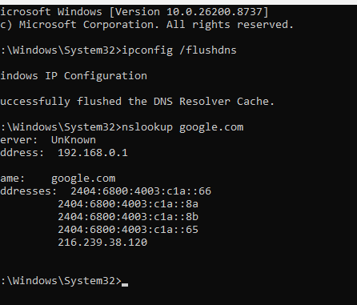
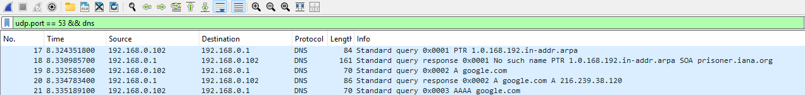
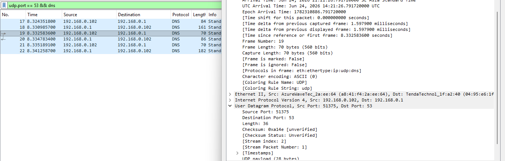
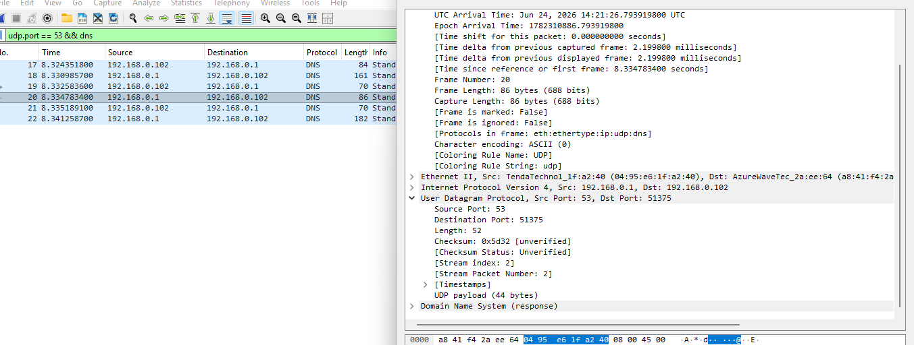
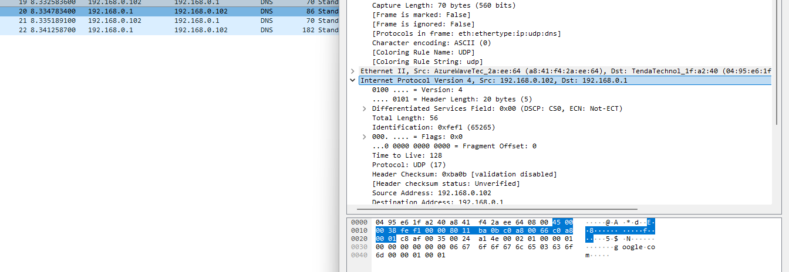
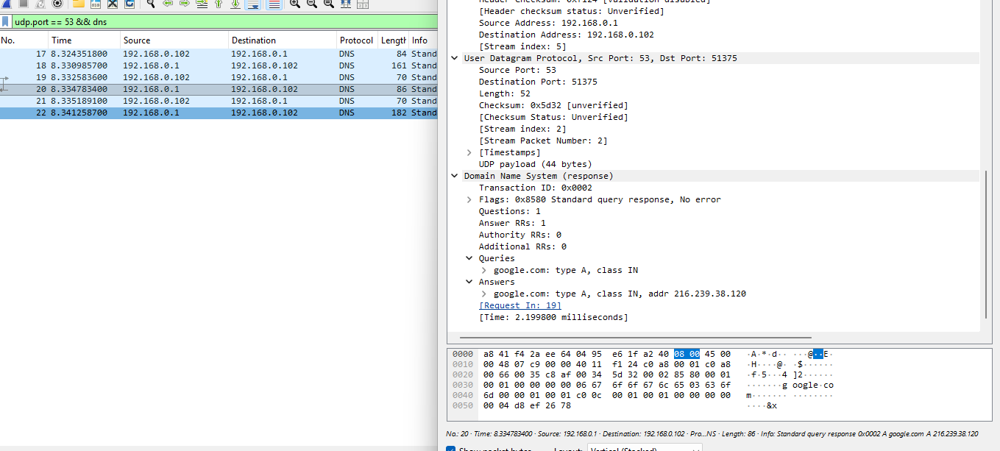

# Laporan Praktikum Jaringan Komputer - Modul 5
## User Datagram Protocol (UDP)

### Identitas Praktikan

| Item | Keterangan |
| :--- | :--- |
| **Nama** | Haniel Juanta Sembiring |
| **NIM** | 103072430008 |
| **Kelas** | IF-04-01 |
| **Modul** | 5: User Datagram Protocol (UDP) |

---

### 5.1 Tujuan Praktikum
1. Menginvestigasi cara kerja User Datagram Protocol (UDP) menggunakan *network analyzer* Wireshark.
2. Mengidentifikasi struktur *header* UDP dan menganalisis *field-field* di dalamnya.
3. Menganalisis pola komunikasi *port source-destination* pada protokol *connectionless*.
4. Menghitung kapasitas *payload* aktual dan mengamati *protocol number* UDP pada *IP Header*.

---

### 5.2 Langkah Kerja
1. Membuka *Command Prompt (CMD)* dengan akses Administrator.
2. Menjalankan *network interface* (Wi-Fi) pada Wireshark untuk memulai proses penangkapan paket (*packet capture*).
3. Mengeksekusi perintah pembersihan *cache* DNS dan memicu *traffic* UDP (DNS Query) melalui CMD:
   `ipconfig /flushdns`
   `nslookup google.com`
   
   *Gambar 1: Tampilan Command Prompt saat mengeksekusi pembersihan DNS dan nslookup.*
4. Menghentikan proses *capture* paket pada Wireshark setelah mendapatkan *output* IP dari perintah di CMD.
5. Menerapkan *display filter* dengan parameter `udp.port == 53 && dns` untuk mengisolasi lalu lintas *request-response* DNS.
   
   *Gambar 2: Penerapan filter UDP dan DNS pada Wireshark menyaring Frame 19 (Query) dan Frame 20 (Response).*

---

### 5.3 Hasil Praktikum

#### 5.3.1 Identitas Koneksi & Hasil Capture
Berdasarkan log *capture* Wireshark, lalu lintas yang memicu protokol UDP terekam pada **Frame 19** (*Query*) dan **Frame 20** (*Response*).

| Parameter | Nilai |
| :--- | :--- |
| **Client IP** | 192.168.0.102 |
| **DNS Server IP** | 192.168.0.1 |
| **Server Port** | 53 (Well-known port untuk DNS) |
| **Target Query** | google.com |

---

#### 5.3.2 Analisis Header UDP
Struktur *Header* UDP memiliki ukuran tetap (*fixed size*) sebesar **8 byte**, yang terdiri dari 4 *field* utama.

**Analisis Frame 19 (DNS Query / Request):**
- **Source Port:** *Ephemeral Port* (Digunakan sementara oleh *client*)
- **Destination Port:** 53
- **Length:** 70 byte
  
  *Gambar 3: Detail UDP Header pada Frame 19 (Query).*

**Analisis Frame 20 (DNS Response / Balasan):**
- **Source Port:** 53
- **Destination Port:** *Ephemeral Port* (Mengikuti Source Port dari *Request*)
- **Length:** 86 byte
  
  *Gambar 4: Detail UDP Header pada Frame 20 (Response) menunjukkan port yang dibalik.*

---

#### 5.3.3 Perhitungan Payload Teknis
*Field Length* pada UDP *header* mencakup total ukuran *header* (8 byte) ditambah dengan data (*payload*). Perhitungan *payload* aktual dari hasil *capture* adalah sebagai berikut:

**Payload DNS Query (Frame 19):**
$$
\text{Payload} = \text{Length} - \text{Header UDP} = 70 - 8 = 62 \text{ bytes}
$$

**Payload DNS Response (Frame 20):**
$$
\text{Payload} = \text{Length} - \text{Header UDP} = 86 - 8 = 78 \text{ bytes}
$$

**Bukti Protocol Number IP Header:**
Pada *Network Layer* (IPv4 Header), paket ini didentifikasi menggunakan **Protocol Number 17 (0x11)** yang merupakan sandi standar IETF untuk UDP.

*Gambar 5: Detail Internet Protocol Version 4 menunjukkan Protocol: UDP (17).*

---

#### 5.3.4 Pola Komunikasi Request-Response
Karena UDP bersifat *connectionless* (tidak ada *handshake*), sinkronisasi paket *request* dan *response* pada DNS diatur menggunakan **Transaction ID**.

- **Transaction ID:** `0x0002` (Sama persis antara Frame 19 dan Frame 20)
- **Mapping Port:** Terdapat pertukaran silang arah *port*. *Source port* pada *request* menjadi *destination port* pada *response*.
- **Hasil Resolusi DNS (Answers):** Server DNS merespons target `google.com` dengan IPv4 (A record) `216.239.38.120`.
  
  *Gambar 6: Detail Domain Name System layer menunjukkan kesamaan Transaction ID dan IP Address balasan.*

---

### 5.4 Ringkasan Hasil

| Parameter | Nilai / Keterangan |
| :--- | :--- |
| **Protokol Transport** | UDP (Connectionless) |
| **Jumlah Field Header** | 4 (Source Port, Dest Port, Length, Checksum) |
| **Ukuran Header UDP** | 8 byte (tetap) |
| **Total Length Query** | 70 byte |
| **Total Length Response** | 86 byte |
| **Protocol Number (IPv4)**| 17 (0x11) |
| **Mekanisme Matching** | Transaction ID pada DNS Layer |

---

### 5.5 Kesimpulan

1. **Efisiensi Overhead:** UDP terbukti memiliki struktur *header* yang sangat ringan (hanya 8 byte), membuatnya ideal untuk protokol seperti DNS yang membutuhkan respons cepat tanpa perlu memelihara sesi koneksi (bebas dari beban *Three-Way Handshake*).
2. **Kalkulasi Payload:** *Field Length* pada Wireshark mengindikasikan total ukuran segmen UDP. Pada praktikum ini, data asli (*payload*) yang dikirimkan adalah 62 byte untuk *query* dan 78 byte untuk *response*.
3. **Pola Porting:** Mekanisme komunikasi berjalan dengan membalik posisi *port*. Target membalas paket ke *ephemeral port* asal yang digunakan *client* (192.168.0.102).
4. **Validasi Reliabilitas Mandiri:** Karena UDP tidak menjamin paket sampai (*unreliable*), lapisan aplikasi (*Application Layer* - DNS) mengambil alih fungsi *tracking* menggunakan mekanisme **Transaction ID** (0x0002) untuk memastikan *response* yang datang cocok dengan *query* yang dikirim.

---

### Daftar Pustaka

1. Kurose, J. F., & Ross, K. W. (2021). *Computer Networking: A Top-Down Approach* (8th Ed.). Pearson.
2. Postel, J. (1980). *RFC 768: User Datagram Protocol*. Internet Engineering Task Force (IETF).
3. Tim Dosen Jaringan Komputer. (2026). *Modul Praktikum Jaringan Komputer*. Program Studi Informatika, Telkom University Surabaya.
4. Wireshark Foundation. (2024). *Wireshark User's Guide*. https://www.wireshark.org/docs/