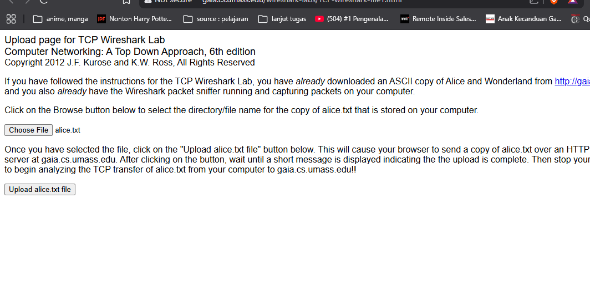
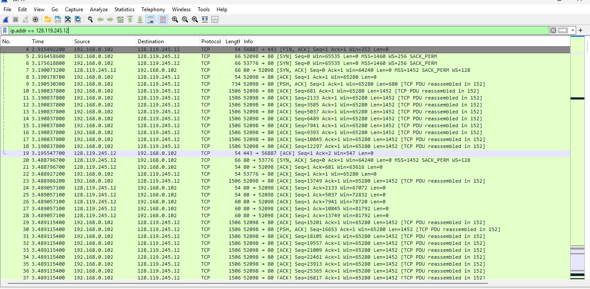
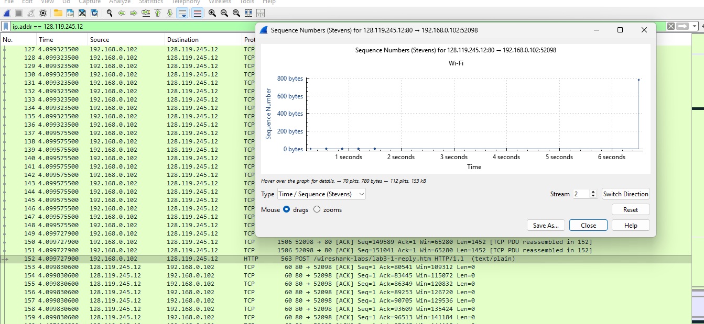
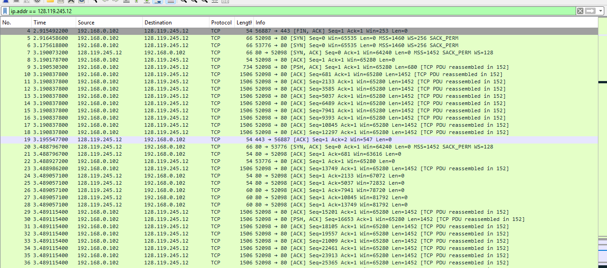
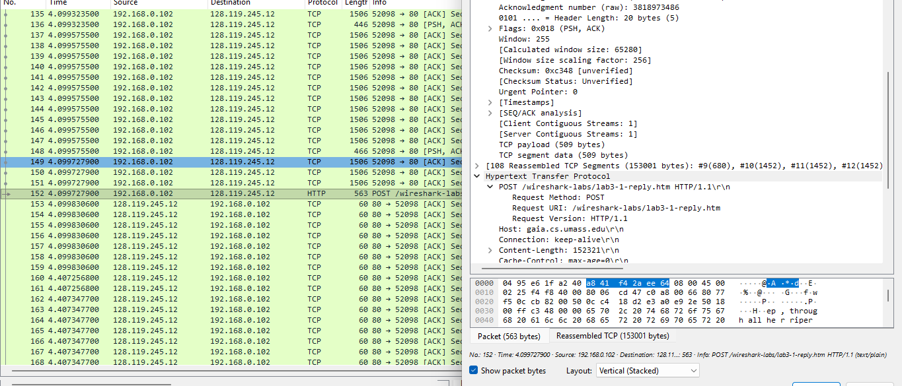
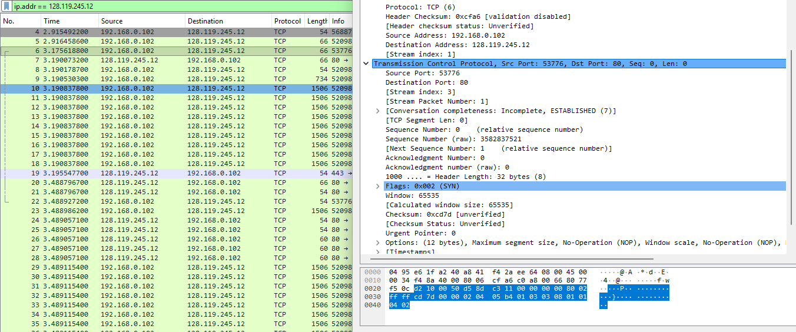
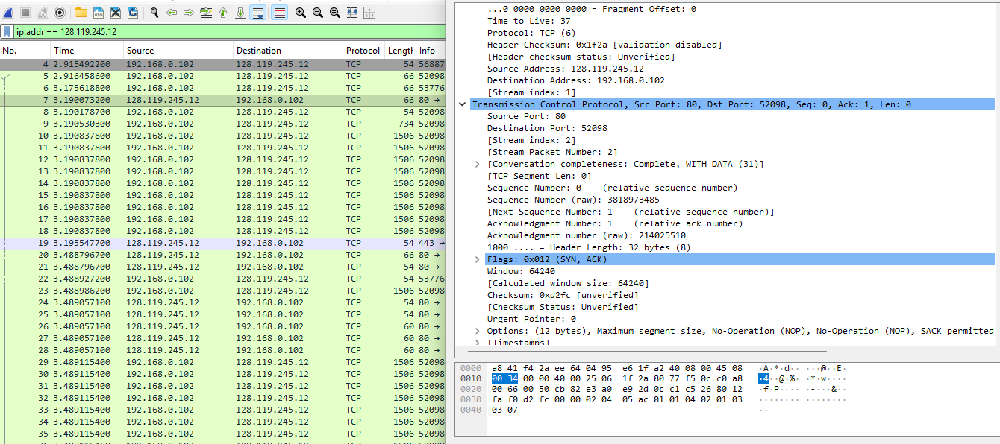
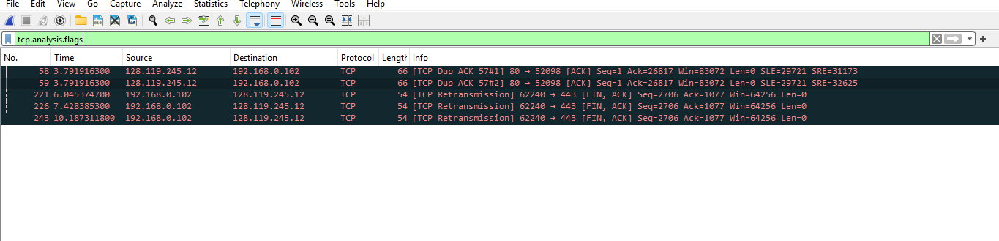

# Laporan Praktikum Jaringan Komputer - Modul 6
## Transmission Control Protocol (TCP) Analysis

### Identitas Praktikan

| Item | Keterangan |
| :--- | :--- |
| **Nama** | Haniel Juanta Sembiring |
| **NIM** | 103072430008 |
| **Kelas** | IF-04-01 |
| **Modul** | 6: TCP Analysis |

---

### 6.1 Tujuan Praktikum
1. Menganalisis mekanisme kerja Transmission Control Protocol (TCP) menggunakan *network analyzer* Wireshark.
2. Mengidentifikasi pola **Sequence Number**, **Acknowledgment**, serta **Reliability Mechanism** pada lalu lintas data.
3. Membuktikan berjalannya fungsi **Congestion Control** (fase *Slow Start* dan *Congestion Avoidance*).
4. Menghitung nilai performansi jaringan, meliputi **Throughput** aktual dan **Round-Trip Time (RTT)** koneksi TCP.

---

### 6.2 Langkah Kerja
1. Mengunduh berkas teks `alice.txt` dari repositori web server UMass:  
   `http://gaia.cs.umass.edu/wireshark-labs/alice.txt`
2. Membuka *interface* upload pada web server UMass dan menyiapkan berkas untuk diunggah.  
   
   *Gambar 1: Tampilan web UMass dalam kondisi standby sebelum upload.*
3. Menjalankan *network interface* (Wi-Fi) pada Wireshark untuk memulai proses penangkapan paket (*packet capture*).
4. Mengeksekusi pengunggahan berkas `alice.txt` pada halaman web dan menunggu hingga notifikasi keberhasilan muncul.
5. Menghentikan proses *capture* paket pada Wireshark setelah transmisi selesai.
6. Menerapkan *display filter* dengan parameter `ip.addr == 128.119.245.12` untuk mengisolasi lalu lintas TCP spesifik ke arah *server* target.  
   
   *Gambar 2: Penerapan filter IP pada Wireshark untuk menyaring lalu lintas server UMass.*

---

### 6.3 Hasil Praktikum

#### 6.3.1 Identitas Koneksi
Berdasarkan log *capture* lalu lintas utama (**Port 80**) yang melayani proses transfer berkas HTTP, identitas sesi koneksi (*TCP Socket*) adalah sebagai berikut:

| Parameter | Nilai |
| :--- | :--- |
| **Client IP** | 192.168.0.102 |
| **Client Port** | 52098 |
| **Server IP** | 128.119.245.12 |
| **Server Port** | 80 |
| **Protokol** | TCP (HTTP) |

---

#### 6.3.2 Three-Way Handshake
Inisiasi koneksi *connection-oriented* terekam dengan urutan *handshake* yang valid pada **Port 80**:

**Segment 1: SYN (Client → Server)**
- **Waktu Terekam:** 2.916 s (**Frame 5**)
- **Parameter:** `Seq = 0`, `Win = 65535`, `MSS = 1460`, `WS = 256`  
  
  *Gambar 8: Detail Flags SYN (0x002) dan Sequence Number pada Frame 5.*

**Segment 2: SYN-ACK (Server → Client)**
- **Waktu Terekam:** 3.190 s (**Frame 7**)
- **Parameter:** `Seq = 0`, `Ack = 1`, `Win = 64240`, `MSS = 1452`, `WS = 128`  
  
  *Gambar 3: Detail Flags SYN-ACK (0x012) dan negosiasi Window Size pada Frame 7.*

**Segment 3: ACK (Client → Server)**
- **Waktu Terekam:** 3.190 s (**Frame 8**)
- **Parameter:** `Seq = 1`, `Ack = 1`, `Win = 65280`

---

#### 6.3.3 HTTP POST Segment
Berkas berukuran besar ditransmisikan melalui proses fragmentasi. Wireshark melakukan proses rekonstruksi (*reassemble*) *payload* TCP ke dalam satu lapisan *Application Layer* utuh:

- **Frame Reassembly:** **Frame 152**
- **Protokol & URI:** `POST /wireshark-labs/lab3-1-reply.htm HTTP/1.1`
- **Total Payload:** ~153,001 bytes  
  
  *Gambar 5: Detail Frame 152 yang menunjukkan HTTP POST dan payload data.*

---

#### 6.3.4 Analisis Segmen: RTT & Estimated RTT
Pengukuran latensi aktual (*Sample RTT*) dikalkulasi dari selisih waktu transmisi segmen pertama dan kedatangan *Acknowledgment* balasan:

- **Timestamp Transmisi (Frame 9):** `3.190530300 s`
- **Timestamp ACK Diterima (Frame 21):** `3.488796700 s`

**Sample RTT Aktual:**
$$
\text{Sample RTT} = 3.488796700 - 3.190530300 = 0.2982664 \text{ s} \approx 298.3 \text{ ms}
$$

Berdasarkan *Sample RTT* di atas, perhitungan *TCP Estimated RTT* yang dimutakhirkan (dengan bobot $\alpha = 0.125$) berpedoman pada formula:

$$
\text{EstimatedRTT}_n = (1 - \alpha) \cdot \text{EstimatedRTT}_{n-1} + \alpha \cdot \text{SampleRTT}_n
$$

---

#### 6.3.5 Flow Control & Window Size
Mekanisme pengontrolan aliran data dievaluasi dari penawaran memori *buffer* oleh server pada balasan awal:

- **Calculated Window Size:** `64240 bytes`
- **Window Size Scaling Factor:** `128`  
  
  *Gambar 4: Detail Calculated Window Size (64240) dan Scaling Factor pada Frame 7.*

**Observasi:**
Ukuran *Window* server (`Win=...`) pada kolom *Info* terus berubah secara dinamis (sebagai contoh, membesar hingga `141184 bytes` pada Frame 159). Hal ini membuktikan algoritma **Flow Control** berhasil mencegah terjadinya kondisi **zero-window** (penuh/macetnya *buffer* penerima).

---

#### 6.3.6 Retransmisi & Pola ACK
Melalui fungsi analitik `tcp.analysis.flags`, terdeteksi anomali transmisi alami yang membuktikan aktifnya mekanisme reliabilitas (*TCP Reliability*):

- **Kejadian Duplicate ACK:** Muncul pada **Frame 58** dan **Frame 59** (`[TCP Dup ACK 57#1]`).
- **Kejadian Retransmission:** Terekam memicu **TCP Retransmission** secara latar belakang pada **Frame 221**, **226**, dan **243**.  
  
  *Gambar 6: Filter `tcp.analysis.flags` yang menunjukkan Dup ACK dan Retransmission.*

**Kesimpulan Mekanisme:**
Terjadinya *Duplicate ACK* menandakan adanya paket yang teracak urutannya (*Out-Of-Order*) akibat kondisi jaringan nirkabel (Wi-Fi). Protokol TCP secara reaktif mendeteksi kehilangan/keacakan ini dan merespons untuk memulihkan kontinuitas aliran data.

---

#### 6.3.7 Perhitungan Throughput Aktual
Performansi jaringan dalam mentransfer berkas `alice.txt` dikalkulasi berdasarkan waktu efektif transmisi:

- **Total Transfer Data:** Dihitung hingga batas persetujuan paket (*Sequence Number* pada Frame 240), menghasilkan volume sebesar **153,002 bytes**.
- **Durasi Efektif:**  
  $$
  \text{Durasi} = t_{\text{akhir}} - t_{\text{awal}} = 4.466 - 3.190 = 1.276 \text{ detik}
  $$

**Formula Throughput:**
$$
\text{Throughput} = \frac{\text{Total Data (bytes)}}{\text{Durasi (s)}} = \frac{153,002}{1.276} \approx 119,907 \text{ bytes/s}
$$

**Hasil Akhir:**
$$
\text{Throughput} \approx 0.95 \text{ Mbps}
$$

---

#### 6.3.8 Analisis Congestion Control
Evaluasi kontrol kongesti divisualisasikan melalui grafik lintasan nomor urut terhadap waktu (*Time-Sequence-Graph*).  

*Gambar 7: Grafik Time-Sequence-Graph (Stevens) yang menunjukkan fase Slow Start dan Congestion Avoidance.*

**Observasi Grafik:**
Kurva grafis mengonfirmasi pola perilaku algoritma TCP. Rapatnya titik-titik data awal yang meningkat dengan tajam mempresentasikan fase **Slow Start**, di mana batas ambang jaringan (*congestion window*) diekspansi secara eksponensial dalam rentang detik ke-3 hingga ke-4 transmisi.

---

### 6.4 Ringkasan Hasil

| Parameter | Nilai / Keterangan |
| :--- | :--- |
| **Protokol** | TCP (Connection-Oriented) |
| **Handshake** | SYN → SYN-ACK → ACK (Valid) |
| **MSS** | Client: 1460 B, Server: 1452 B |
| **Window Size** | Dinamis (Mulai 64240 bytes) |
| **RTT** | ~298.3 ms |
| **Retransmisi** | Terdeteksi (Bukti Reliability) |
| **Throughput** | ~0.95 Mbps |
| **Congestion Control** | Slow Start → Congestion Avoidance |

---

### 6.5 Kesimpulan

1.  **Fase Inisiasi:** Negosiasi koneksi TCP sukses dikukuhkan melalui **Three-Way Handshake** dengan penyepakatan parameter *Maximum Segment Size* (MSS) dan utilitas *Window Scaling* untuk optimalisasi saluran data.
2.  **Kinerja Flow Control:** Protokol terbukti stabil dalam meregulasi arus paket (*byte stream*). Fleksibilitas memori *buffer* server web UMass mencukupi kebutuhan sehingga transmisi tidak pernah mencapai status penangguhan (*zero-window*).
3.  **Keandalan Jaringan (Reliability):** Validasi empiris membuktikan berfungsinya mekanisme pemulihan TCP. Indikasi paket data yang tiba tidak berurutan langsung direspons secara proaktif oleh sistem dengan pelaporan *Duplicate ACK* untuk menginisiasi retransmisi dan mencegah korupsi berkas.
4.  **Metrik Performansi:** Proses pengunggahan muatan data HTTP POST sebesar 153 KB pada topologi koneksi terukur menembus **Throughput** rata-rata di angka **~0.95 Mbps**, dengan nilai **Round-Trip Time (RTT)** stabil di kisaran **~298.3 ms**.

---

### Daftar Pustaka

1.  Kurose, J. F., & Ross, K. W. (2021). *Computer Networking: A Top-Down Approach* (8th Ed.). Pearson.
2.  Postel, J. (1981). *RFC 793: Transmission Control Protocol*. Internet Engineering Task Force (IETF).
3.  Allman, M., Paxson, V., & Blanton, E. (2009). *RFC 5681: TCP Congestion Control*. Internet Engineering Task Force (IETF).
4.  Tim Dosen Jaringan Komputer. (2026). *Modul Praktikum Jaringan Komputer*. Program Studi Informatika, Telkom University Surabaya.
5.  Wireshark Foundation. (2024). *Wireshark User's Guide*. https://www.wireshark.org/docs/
```
