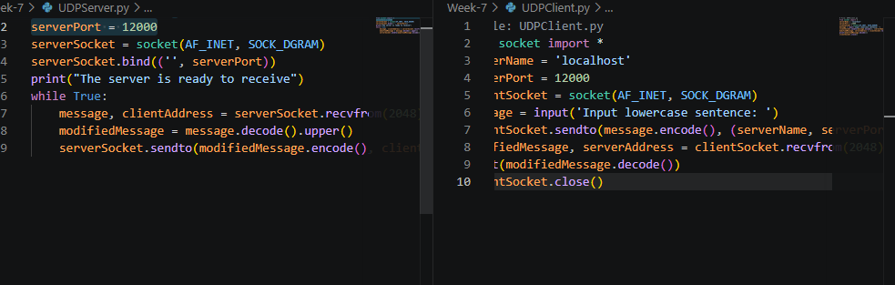
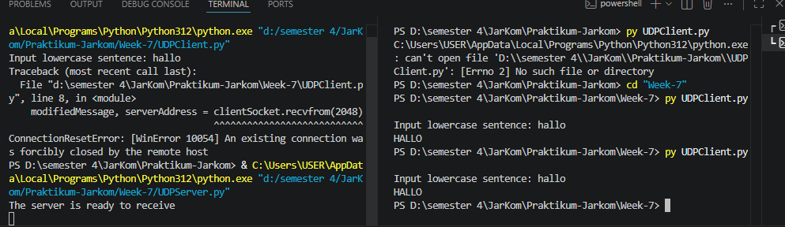
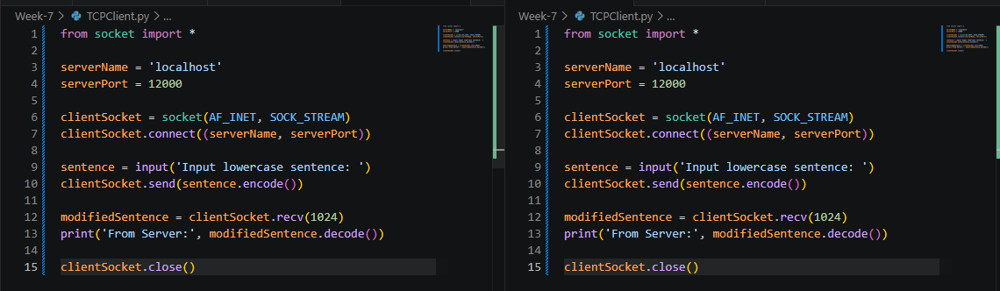
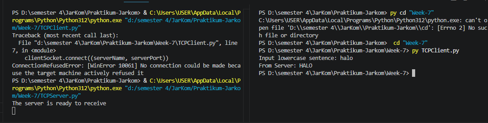

# Laporan Praktikum Jaringan Komputer - Modul 7
## Socket Programming: UDP dan TCP

### Identitas Praktikan
| Item | Keterangan |
| :--- | :--- |
| **Nama** | Haniel Juanta Sembiring |
| **NIM** | 103072430008 |
| **Kelas** | IF-04-01 |
| **Modul** | 7: Socket Programming |

---

### 7.1 Tujuan Praktikum
1. Mengimplementasikan aplikasi client-server menggunakan **UDP Socket**.
2. Mengimplementasikan aplikasi client-server menggunakan **TCP Socket**.
3. Menganalisis perbedaan mekanisme kerja antara protokol *connectionless* (UDP) dan *connection-oriented* (TCP).
4. Memahami penanganan error dan pola komunikasi pada kedua protokol.

---

### 7.2 Praktikum UDP Socket

#### 7.2.1 Kode Program UDP
Implementasi server UDP menggunakan `SOCK_DGRAM` yang bersifat *connectionless*. Server hanya menunggu pesan di port tertentu tanpa perlu negosiasi koneksi awal.

**File: `UDPServer.py`**
```python
from socket import *
serverPort = 12000
serverSocket = socket(AF_INET, SOCK_DGRAM)
serverSocket.bind(('', serverPort))
print("The server is ready to receive")

while True:
    message, clientAddress = serverSocket.recvfrom(2048)
    modifiedMessage = message.decode().upper()
    serverSocket.sendto(modifiedMessage.encode(), clientAddress)
```

**File: `UDPClient.py`**
```python
from socket import *
serverName = '127.0.0.1'
serverPort = 12000
clientSocket = socket(AF_INET, SOCK_DGRAM)

message = input('Input lowercase sentence: ')
clientSocket.sendto(message.encode(), (serverName, serverPort))
modifiedMessage, serverAddress = clientSocket.recvfrom(2048)
print(modifiedMessage.decode())
clientSocket.close()
```


*Keterangan: Kode sumber untuk komunikasi UDP menggunakan `sendto()` dan `recvfrom()` tanpa handshake.*

#### 7.2.2 Hasil Eksekusi UDP
Komunikasi UDP dilakukan tanpa inisiasi koneksi. Client langsung mengirim paket ke server, dan server langsung membalas setelah menerima pesan.

**Proses:**
1. Jalankan `UDPServer.py`. Server menampilkan pesan "ready to receive".
2. Jalankan `UDPClient.py`.
3. Input: `hello world`
4. Output Server: `HELLO WORLD`


*Keterangan: Terminal menunjukkan input client dan balasan uppercase dari server tanpa proses handshake.*

---

### 7.3 Praktikum TCP Socket

#### 7.3.1 Kode Program TCP
Implementasi server TCP menggunakan `SOCK_STREAM` yang bersifat *connection-oriented*. Server harus melakukan `listen()` dan `accept()` sebelum menerima data.

**File: `TCPServer.py`**
```python
from socket import *
serverPort = 12000
serverSocket = socket(AF_INET, SOCK_STREAM)
serverSocket.bind(('', serverPort))
serverSocket.listen(1)
print('The server is ready to receive')

while True:
    connectionSocket, addr = serverSocket.accept()
    sentence = connectionSocket.recv(1024).decode()
    capitalizedSentence = sentence.upper()
    connectionSocket.send(capitalizedSentence.encode())
    connectionSocket.close()
```

**File: `TCPClient.py`**
```python
from socket import *
serverName = '127.0.0.1'
serverPort = 12000
clientSocket = socket(AF_INET, SOCK_STREAM)
clientSocket.connect((serverName, serverPort))

sentence = input('Input lowercase sentence: ')
clientSocket.send(sentence.encode())
modifiedSentence = clientSocket.recv(1024)
print('From Server:', modifiedSentence.decode())
clientSocket.close()
```


*Keterangan: Kode sumber untuk komunikasi TCP menggunakan `connect()`, `accept()`, `send()`, dan `recv()`.*

#### 7.3.2 Hasil Eksekusi TCP
Komunikasi TCP memerlukan proses *Three-Way Handshake* sebelum data ditransfer. Jika server belum berjalan saat client mencoba connect, akan muncul error `ConnectionRefusedError`.

**Skenario 1: Server Belum Jalan (Error)**
Client mencoba connect ke server yang belum aktif, menghasilkan error:
`ConnectionRefusedError: [WinError 10061] No connection could be made because the target machine actively refused it`.

**Skenario 2: Server Sudah Jalan (Sukses)**
Setelah server dijalankan, client berhasil terhubung dan mengirim data.
- Input: `networking lab`
- Output: `From Server: NETWORKING LAB`


*Keterangan: Terminal menunjukkan error saat server mati dan kesuksesan koneksi setelah server aktif.*

---

### 7.4 Analisis Praktikum

#### 7.4.1 Perbedaan Implementasi Kode

| Aspek | UDP Socket | TCP Socket |
| :--- | :--- | :--- |
| **Tipe Socket** | `SOCK_DGRAM` | `SOCK_STREAM` |
| **Koneksi** | Tidak perlu `connect()` | Wajib `connect()`, `listen()`, `accept()` |
| **Pengiriman** | `sendto()`, `recvfrom()` | `send()`, `recv()` |
| **Alamat** | Harus specify alamat tujuan setiap kirim | Otomatis (rute sudah terbentuk) |
| **Jumlah Socket Server** | 1 socket untuk semua client | 2 socket (`serverSocket` + `connectionSocket`) |

#### 7.4.2 Analisis Perilaku
1. **UDP (Connectionless):**
   - Sangat ringan karena tidak ada overhead pembuatan dan pemeliharaan koneksi.
   - Server menggunakan satu socket untuk menangani semua klien yang masuk.
   - Tidak ada jaminan paket sampai, tidak ada urutan, dan tidak ada retransmisi otomatis.
   - Cocok untuk aplikasi yang mengutamakan kecepatan (real-time) seperti streaming video atau gaming.

2. **TCP (Connection-Oriented):**
   - Memerlukan inisiasi koneksi (*Three-Way Handshake*) yang menjamin kedua belah pihak siap.
   - Server membuat socket khusus (`connectionSocket`) untuk setiap klien yang terhubung.
   - Memiliki mekanisme *flow control*, *congestion control*, dan *retransmission* untuk menjamin keandalan data.
   - Jika server tidak berjalan, klien akan langsung mendapatkan error `ConnectionRefusedError`, seperti yang terlihat pada Gambar 4.
   - Cocok untuk aplikasi yang memerlukan integritas data tinggi seperti web browsing, email, dan transfer file.

---

### 7.5 Kesimpulan
1. **Socket Programming** memberikan kontrol penuh kepada pengembang untuk berkomunikasi di *Application Layer* menggunakan *Transport Layer* (UDP/TCP) sesuai kebutuhan.
2. **UDP** terbukti lebih sederhana dan cepat untuk pengiriman data yang toleran terhadap kehilangan paket, karena tidak memerlukan proses *handshake*.
3. **TCP** menjamin keandalan pengiriman data melalui mekanisme koneksi yang ketat, meskipun memiliki *overhead* yang lebih besar.
4. Pemilihan protokol (UDP vs TCP) sangat bergantung pada prioritas aplikasi: **kecepatan** (UDP) atau **keandalan** (TCP).

---

### Daftar Pustaka
1. Kurose, J. F., & Ross, K. W. (2021). *Computer Networking: A Top-Down Approach* (8th Ed.). Pearson.
2. Python Software Foundation. (2024). *Python Socket Documentation*. https://docs.python.org/3/library/socket.html
3. Tim Dosen Jaringan Komputer. (2026). *Modul Praktikum Jaringan Komputer*. Program Studi Informatika, Telkom University Surabaya.
```
