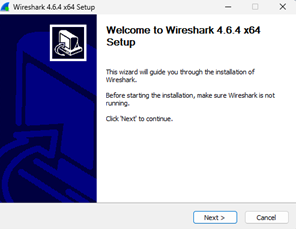
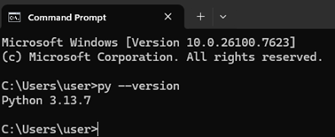

# Laporan Praktikum Jaringan Komputer - Minggu 1
## Modul 1: Running Modul

**Identitas Praktikan:**
* **Nama:** Haniel Juanta Sembiring
* **NIM:** 103072400145
* **Jurusan/Fakultas:** Informatika
* **Universitas:** Universitas Telkom Surabaya (2026)

---

### 1. Tujuan Praktikum
Memastikan perangkat lunak (*tools*) Wireshark dan Python telah terinstal dengan benar dan siap digunakan di komputer lokal.

### 2. Instalasi Wireshark
* Wireshark diunduh melalui situs resmi [wireshark.org](http://www.wireshark.org/).
* Proses instalasi dilakukan menggunakan wizard standar hingga selesai.

*Gambar 1: Bukti Instalasi Wireshark*

### 3. Instalasi dan Verifikasi Python
* Python diunduh melalui situs resmi [python.org](https://www.python.org/downloads/).
* Verifikasi instalasi dan *environment variables* dilakukan via Command Prompt dengan perintah:
  py --version
  